
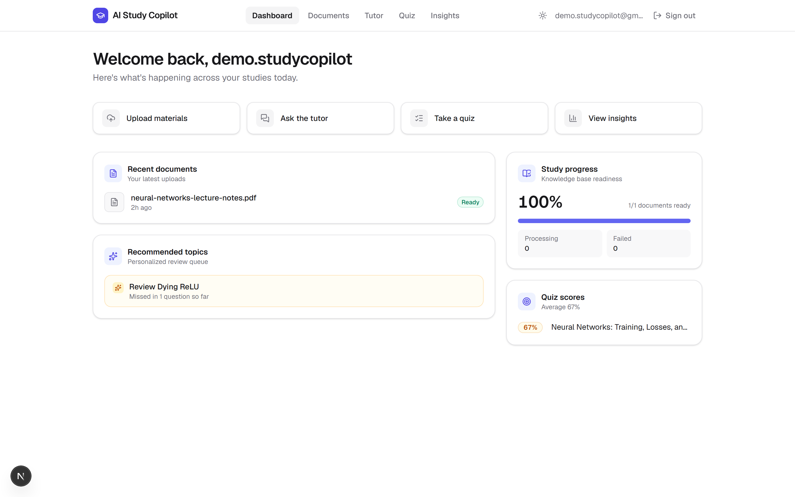
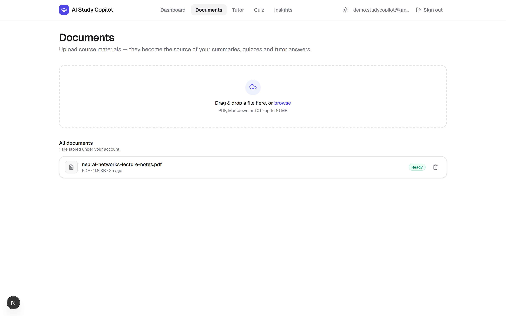
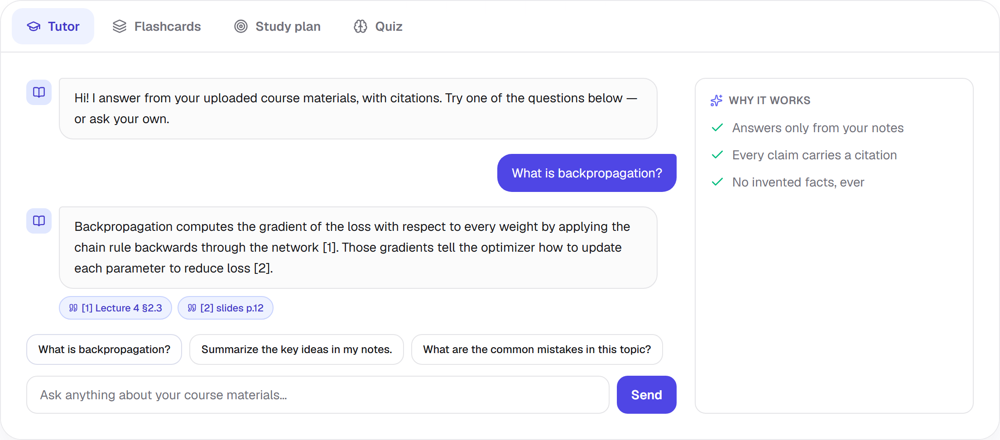
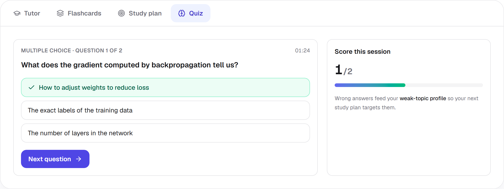
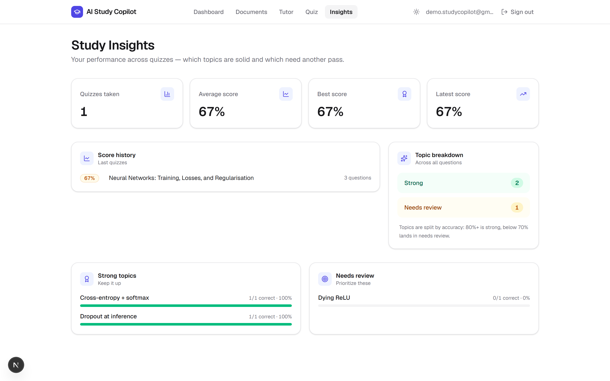

# AI Study Copilot

**Turn course materials into lasting memory.** A privacy-first, RAG-grounded
learning system built with Next.js 16, Supabase, and any OpenAI-compatible
LLM. It does not wrap a chat UI around a GPT prompt — it builds a real
knowledge base from your notes, PDFs and slides, then coaches you through an
evidence-backed study loop: read → recall → practice → teach → review.

[](https://nextjs.org)
[](https://www.typescriptlang.org)
[](https://tailwindcss.com)
[](https://supabase.com)
[](./LICENSE)

---

## What it does

| Feature | Description |
|---------|-------------|
| **AI tutor** | Ask questions about your notes. Every answer cites the exact source passage (grounded RAG — no hallucination). |
| **Auto-generated quizzes** | Mixed MCQs, true/false and short-answer from any document. Automatic scoring with weak-topic analysis. |
| **Study plans** | A coach-designed daily schedule built from your weak topics and course content. Read → recall → practice → teach → review. |
| **Spaced-repetition flashcards** | Generate active-recall decks with flip-cards, keyboard shortcuts and mastery tracking. |
| **Document processing** | Upload PDF, Markdown or plain text. Extracted, chunked, embedded and indexed automatically. |
| **Progress dashboard** | Quiz scores, topic-wise strengths/weaknesses, study streaks and a built-in Pomodoro focus timer. |

## Quick-start

```bash
cp .env.example .env.local   # fill NEXT_PUBLIC_SUPABASE_URL, *ANON_KEY, AI_CHAT_API_KEY
npm install
npm run dev                  # http://localhost:3000
```

Apply the Supabase migrations (`supabase/migrations`) and storage setup
(`supabase/setup.sql`) before uploading documents. Embedded vectors are
local by default (transformers.js); set `AI_EMBEDDING_BASE_URL` to use a
hosted OpenAI-compatible embeddings API instead.

## Architecture

```
┌──────────────┐   ┌──────────────┐   ┌──────────────┐
│ Next.js 16   │──▶│ Supabase     │──▶│ LLM (OpenAI  │
│ (TS + RSC)   │   │ (pgvector +  │   │  compatible) │
│              │◀──│  RLS + auth) │◀──│              │
└──────────────┘   └──────────────┘   └──────────────┘
      │
      ▼
  ├─ /        Marketing landing
  ├─ /dashboard   Welcome + quick actions + focus timer
  ├─ /documents   Upload, list, reprocess, delete
  ├─ /tutor       Grounded Q&A with source citations
  ├─ /flashcards  Active-recall deck generation & practice
  ├─ /study-plan  AI-generated daily learning schedule
  ├─ /quiz        Generate, take, grade quizzes
  └─ /insights    Score trends, topic breakdown, weak spots
```

## Key design choices

- **Rate limiting** — sliding-window, per-user/IP across all generation
  endpoints.
- **Request-body guard** — 64 KB ceiling on every JSON payload; oversized
  bodies are rejected before parsing.
- **Parsing-validation-first** — every AI response is parsed through a
  strict validator before it reaches the UI, never injected raw.
- **Privacy by construction** — RLS policies scope documents, chunks and
  quiz data to the signed-in user; files are never shared across accounts.
- **Responsive motion system** — custom CSS keyframes with
  `prefers-reduced-motion` support, staggered entrance animations,
  glass-morphism header, aurora gradients and micro-interactions.
- **Provider agnostic** — chat and embedding models are configured purely
  through environment variables (DeepSeek, OpenAI, Groq, local servers…).

## Screenshots

| Landing | Dashboard | Documents | Tutor | Flashcards | Study plan | Quiz | Insights |
|:---:|:---:|:---:|:---:|:---:|:---:|:---:|:---:|
|  |  |  |  | *(coming)* | *(coming)* |  |  |

> Run `node scripts/screenshot.mjs` with a running dev server to update them.

## Scripts

| Script | Purpose |
|--------|---------|
| `npm run dev` | Next.js dev server (Turbopack) |
| `npm run build` | Production build + type-check |
| `npm run lint` | ESLint across the project |
| `npm test` | Vitest (87 tests, 13 suites) |
| `node scripts/e2e-smoke.mjs` | End-to-end smoke check covering auth, upload, tutor, quiz |

## License

MIT — built in the open so students everywhere can own their learning.
